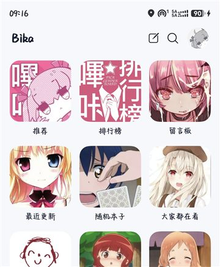
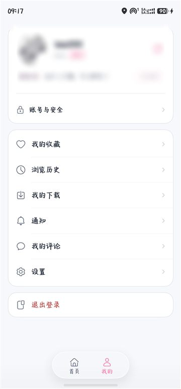
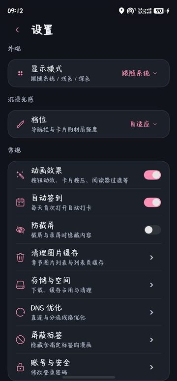
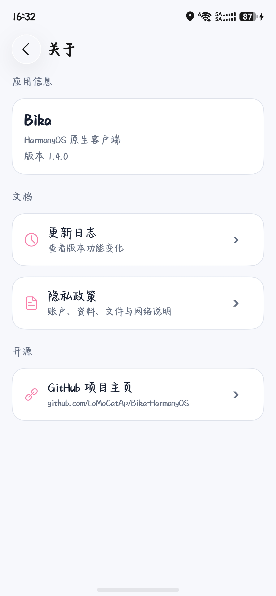

# Bika HarmonyOS

<p align="center">
  
  
  
  
</p>

## 声明

本仓库的所有内容仅供学习交流使用。如果您认为该内容侵犯了您的权益，请在 issue 中与我们联系，我们将立即删除相关内容。

## 简介

哔咔漫画的 HarmonyOS NEXT 第三方客户端，使用 ArkTS 与 ArkUI 原生构建，不依赖任何跨平台运行时。
从频道浏览、详情互动到阅读器与离线下载形成完整闭环，并针对手机与平板做了自适应适配。

## 界面预览

<p align="center">
  
  
  
  
</p>

<p align="center">
  <sub>首页频道 · 我的 · 设置 · 关于</sub>
</p>

## 版本说明

- **当前版本：v1.4.2**
- 新增应用接续（跨设备续接当前页面）、下载后台运行与下载进度通知。
- 修复：弹窗双层边框与底色不一致；频道页与评论区的下拉刷新、加载提示问题。
- 新增：未登录进入应用时引导登录（每个版本最多提示一次，从登录页返回可直接浏览）。
- 主页新增下拉刷新；未登录时首页改为登录引导形态。
- 注册页界面风格与登录页统一，标题栏改用与「我的」子页一致的沉浸光感样式。
- 修复：冷启动时短暂显示未登录；深色模式下更新日志与隐私政策弹窗底色与应用背景不一致。
- 修复：桌面卡片多卡同时刷新导致刷新超时、封面偶发不显示、退出登录后仍显示上一账号内容等问题。
- 隐私：系统日志不再记录作品名等敏感信息；退出登录会一并清理历史与卡片缓存。
- 桌面小组件共 5 张卡片：继续阅读 / 最近更新 / 排行榜 / 我的收藏 / 为你推荐，支持真实封面与点击直达，跟随系统深浅色。
- 页面标题栏沉浸光感：静止透明、上滑渐显模糊，覆盖「我的」全部 12 个子页。
- 目标版本 **API 26**；Toast 与系统弹窗为沉浸光感材质，需系统支持 **HarmonyOS 7.0.0 及以上**。
- 从 v1.3.6 起页面卡片已回退为常规列表样式（官方接口调整，兼顾功耗表现）。

完整更新内容见应用内「设置 → 关于 → 更新日志」，或仓库的 [Releases](https://github.com/LoMoCatAp/Bika-HarmonyOS/releases)。

## 当前功能

### 账号与资料

- 用户名 + 密码登录（不支持邮箱登录），凭据本地加密保存与自动重登。
- 注册：用户名、昵称、密码与三道密保题；注册成功自动回填用户名。
- 资料编辑（个人签名）、修改密码（成功后需重新登录）、退出登录。
- 签到与签到状态记忆，防止重复签到。

### 首页与频道

- 首页 45 个频道：推荐、排行榜、最近更新、随机本子及题材 / 属性 / IP 分区。
- 频道自定义：排序、隐藏、一键恢复默认。
- 频道列表统一支持排序（最新 / 最旧 / 最多爱心 / 最多观看）。
- 频道列表支持五组筛选：主题、排除主题、状态、话数、页数。
- 按接口能力区分特色频道：「推荐」「那年今天」无排序无筛选；「大家都在看」「官方都在看」无排序。
- 排行榜：日榜、周榜、月榜与骑士榜。

### 漫画详情与互动

- 详情 / 章节 / 评论三 Tab，相关推荐，收藏与点赞。
- 评论排序（最新 / 最早 / 最多赞）与分页加载。
- 评论点赞、回复、发表，子回复展开。
- 系统分享面板分享作品。

### 阅读器

- 五种阅读模式，沉浸式工具栏与设置面板。
- 横竖屏锁定、亮度调节、页级阅读进度记忆与自动恢复。
- 音量键翻页（可开关），页码提示胶囊。
- 长按图片拖拽到中转站或其它应用（系统拖拽能力）。
- 导出当前章节为 PDF 或图片压缩包，支持自选保存位置与文件名。
- 平板限宽居中显示，两侧留黑，避免大屏图片被拉伸。

### 下载与缓存

- 仅 WiFi 下载、并发数设置、失败重试、本地离线阅读与单作品删除。
- 三级图片缓存：内存缓存 + 200MB 磁盘 LRU 缓存 + 多镜像线路回退。

### 搜索

- 关键词推荐、高级搜索与排序。
- 搜索历史记录与一键清空。

### 设置与网络

- 显示模式（浅色 / 深色 / 跟随系统）与沉浸光感档位。
- 全局动画开关，统一控制按钮弹簧、卡片按压、图片占位呼吸、工具栏过渡等动效。
- 自动签到、防截屏、屏蔽标签（频道与搜索结果生效）。
- 存储与空间管理（下载占用、缓存占用、一键清理）、清理图片缓存。
- DNS 优化：分流线路拉取、IP 握手测速、按最低延迟自动选择、支持手动点选与重置。
- 系统代理：规则模式分流，无需全局模式即可访问。
- 检查更新：对接 GitHub Release，可直接跳转下载。
- 关于页：应用信息、更新日志与隐私政策。

### 适配

- 深浅色主题全量适配，颜色资源双份维护。
- 平板自适应：频道网格与作品列表按屏幕宽度动态调整列数（平板最多 6 列）。
- 列表底部按安全区与悬浮导航栏留白，避免内容被遮挡。

## 近期更新

| 版本 | 主要内容 |
|---|---|
| **v1.4.2** | 新增应用接续、下载后台运行、下载进度通知；修复下载页进度不实时刷新与仅 WiFi 不派发 |
| v1.4.1 | 修复弹窗边框与底色不一致；修复频道页与评论区下拉刷新、上拉加载更多缺少加载提示 |
| v1.4.0 | 未登录引导登录、主页下拉刷新；注册页统一并改沉浸光感标题栏；修复冷启动登录态闪烁、弹窗深色底色、桌面卡片刷新与封面问题 |
| v1.3.8 | 标题栏沉浸光感（「我的」12 个子页）；新增 5 张桌面小组件卡片 |
| v1.3.7 | 目标版本升级至 API 26；Toast 与系统弹窗升级为沉浸光感材质 |
| v1.3.6 | 官方接口调整，页面卡片回退常规列表；优化「退出登录」文字配色 |
| v1.3.5 | 分类列表响应解析修复；「推荐」改为全部最新分页流；特色频道排序筛选按接口区分 |
| v1.3.4 | 分类页加载重试与空态；主页 / 收藏页底部留白；相关推荐空时回退 |
| v1.3.3 | 平板自适应网格；阅读器限宽居中，两侧留黑 |
| v1.3.2 | 修复更新日志 / 隐私政策弹窗；沉浸光感档位即时生效 |
| v1.3.1 | 全局动画开关与全套动效；材质档位即时生效；系统代理规则分流；下载删除修复 |
| v1.3.0 | 评论排序与分页；系统分享；音量键翻页；磁盘缓存；图片拖拽；PDF / ZIP 导出 |

## 致谢

本项目在实现过程中参考了以下项目，特此致谢：

- [shizq123/BIKA](https://github.com/shizq123/BIKA) — 哔咔 Android 客户端，功能与交互的主要参考。
- [raoxwup/haka_comic](https://github.com/raoxwup/haka_comic) — 请求签名与图片镜像链路的协议参考。
- [YuanChu-Tec/JMComic-HarmonyOS](https://github.com/YuanChu-Tec/JMComic-HarmonyOS) — HarmonyOS 阅读器工程结构与体验参考。
- 哔咔官方服务与国内镜像线路 — API 与图片服务来源。

## 源码运行

1. 安装 DevEco Studio，并在 SDK Manager 中安装 HarmonyOS SDK API 26 或更新版本。
2. 将 `build-profile.json5.example` 复制为本机的 `build-profile.json5`，并在 DevEco Studio 中配置自己的签名材料；该文件已被 Git 忽略。
3. 使用 DevEco Studio 打开项目根目录，选择 `entry` 模块和已连接设备或模拟器后运行。

也可以在 PowerShell 中构建：

```powershell
$env:DEVECO_SDK_HOME = 'C:\Program Files\Huawei\DevEco Studio\sdk'
node 'C:\Program Files\Huawei\DevEco Studio\tools\hvigor\bin\hvigorw.js' --mode module -p product=default -p buildMode=debug assembleHap --no-daemon
```

生成的 HAP 位于 `entry/build/default/outputs/default/`。

命令行安装到已连接设备：

```powershell
hdc install -r entry\build\default\outputs\default\entry-default-signed.hap
hdc shell aa start -a EntryAbility -b com.lomocat.bika
```

## 隐私与数据

- 登录凭据仅保存在应用私有目录，用于访问哔咔 API。
- 头像、昵称、等级等资料由哔咔服务器提供，应用不额外收集或上传。
- 下载的漫画与图片缓存储存在应用沙箱内，卸载后随沙箱一并清除。
- 网络请求仅发往哔咔官方接口（含国内镜像线路），不包含第三方统计。

完整说明见应用内「关于 → 隐私政策」。

## 项目结构

```text
AppScope/                           应用级配置和图标资源
entry/src/main/ets/
  entryability/                     应用入口：窗口、颜色模式与设置恢复
  entrybackupability/               备份扩展能力
  common/                           常量、缓存、下载、图片加载、导出与材质兼容层
  components/                       可复用 ArkUI 组件（漫画卡片、网络图片）
  models/                           领域模型与视图模型
  network/                          请求签名、直连路由、DNS 与 API 服务
  pages/                            首页、频道、详情、阅读器、搜索、登录注册等页面
entry/src/main/resources/           字符串、颜色（浅色 / 深色）与主题资源
```

## 反馈

- 项目仓库：[LoMoCatAp/Bika-HarmonyOS](https://github.com/LoMoCatAp/Bika-HarmonyOS)
- 问题反馈：[GitHub Issues](https://github.com/LoMoCatAp/Bika-HarmonyOS/issues)

## License

本项目基于 [GNU General Public License v3.0](LICENSE) 开源。
